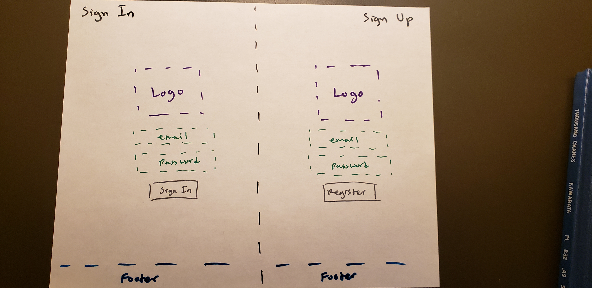

## Table of Contents

* [Overview](#overview)
* [Milestones](#milestones)

## Overview
Gregory is an event planner to create ics calendar files for clients to use in their calendar application of their
 choice. It's name is a reference to [Pope Gregory XIII](https://en.wikipedia.org/wiki/Pope_Gregory_XIII) who is tha
  namesake of the Gregorian calendar.
 
## Milestones

### Week 5 Milestone
**Completed Objectives:**
* Created [project repository](https://github.com/Team-Pickled-Plums)
* Tested ics file with Google Calendar
* Created [software engineering process document](https://docs.google.com/document/d/1Yua-Onoxcz0KLDCkWDWWIjIUD_rV3oQIrFKp3TF4Syo/edit?usp=sharing)

### Week 7 Milestone
**Completed Objectives:**
* Created basic code that generates .ics files
* User stories
* Kanban board
* Sketch of user interface (shown below)

### Week 9 Milestone
**Completed Objectives:**
* Test Driven Development (i.e. can't have Feb 30, Days over 31, etc.)
* User menu with checks
* Created plan for recurring events

### Week 11 Milestone

### Test Driven Development Stories

## Team Members
- Christopher Won
- Matt Schultz
- Arslan Rakhmankulov
- Rusty Jacinto
