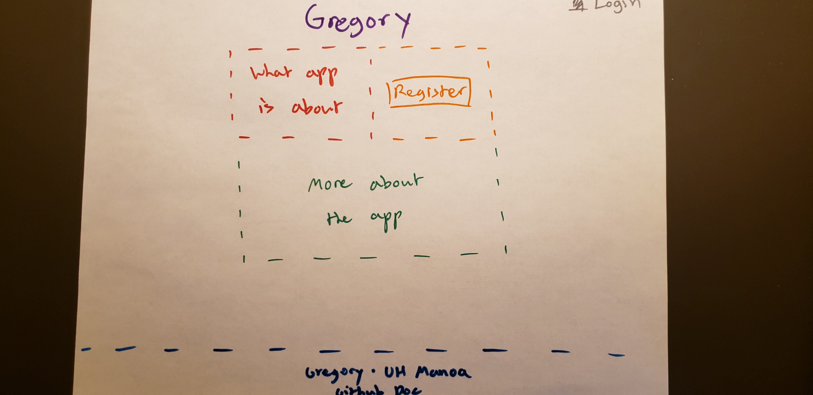
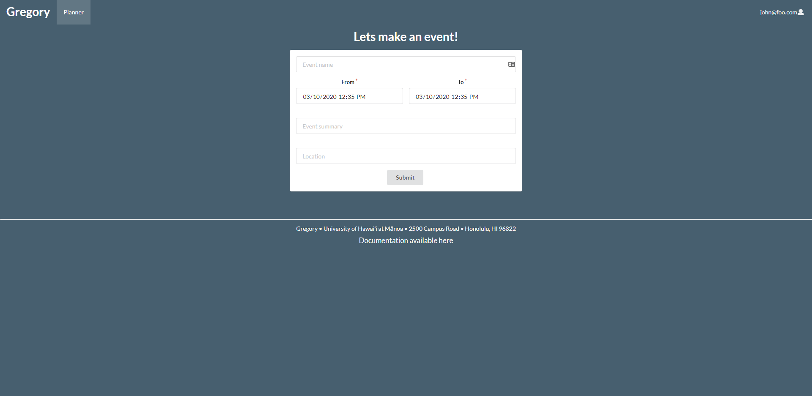

## Table of Contents

* [Overview](#overview)
* [Milestones](#milestones)

## Overview
Gregory is an event planner to create ics calendar files for clients to use in their calendar application of their
 choice. It's name is a reference to [Pope Gregory XIII](https://en.wikipedia.org/wiki/Pope_Gregory_XIII) who is tha
  namesake of the Gregorian calendar.
  
## Final Functionality
Version (section 3.7.4 of RFC 5545)

* Classification (3.8.1.3). Note this is a way of users designating events as
public (default), private, or confidential.
* Geographic Position (3.8.1.6)
* Location (3.8.1.7)
* Priority (3.8.1.9)
* Summary (3.8.1.12)

* DTSTART (3.8.2.4)

* DTEND (3.8.2.2)

* Time zone identifier (3.8.3.1)
* RSVP (3.2.17)
* Sent-by (3.2.18)
* Resources (3.8.1.10)
* And aspects (your choice) of recurring events (3.8.5). Recurring events (and
exceptions to recurrences) can be very complicated. Start small and do what
you can. For example, you might want to start with being able to schedule a
meeting on the 25th of every month. Then add the ability to do exceptions,
such as “except in December”).

 
## Milestones

### Week 5 Milestone
**Completed Objectives:**
* Created [project repository](https://github.com/Team-Pickled-Plums)
* Tested ics file with Google Calendar
* Created [software engineering process document](https://docs.google.com/document/d/1Yua-Onoxcz0KLDCkWDWWIjIUD_rV3oQIrFKp3TF4Syo/edit?usp=sharing)

### Week 7 Milestone
**Completed Objectives:**
* Created basic code that generates .ics files
* User stories
* Kanban board
* Sketch of user interface (shown below)

### Week 9 Milestone
**Completed Objectives:**
* Test Driven Development (i.e. can't have Feb 30, Days over 31, etc.)
* User menu with checks
* Created plan for recurring events

### Week 11 Milestone
**Completed Objectives:**
* Priority (3.8.1.9)
* Classification (3.8.1.3) 
* Summary (3.8.1.12)

* Location (3.8.1.7)
* Geographic Position (3.8.1.6)

### Week 13 Milestone
**Completed Objectives:**
* RSVP (3.2.17)
* Time zone identifier (3.8.3.1)
* Resources (3.8.1.10)
* Recurring Events (basic)

### Week 15 Milestone

### Test Driven Development Stories
* Case: RSVP one person. Result: pass.
* Case: RVSP two people. Result: failed.
***Adjusted string parsing***
* Case: RSVP one person. Result: pass.
* Case: RVSP two people. Result: pass.

* Case: Import generated ics file imported into Google Calendar. Result: displayed incorrect time (10 hours ahead).
* Case: Import generated ics file imported into Outlook. Result: displayed incorrect time (10 hours ahead).
***Implemented TZID***
* Case: Import generated ics file imported into Google Calendar. Result: displayed correct time.
* Case: Import generated ics file imported into Outlook. Result: displayed correct time.

* Case: Required event name. Result: pass 

* Case: Prevent backwards time intervals (March 30th to Jan 31th). Result: pass 

* Case: Only able to select/type valid dates. Result: able to type invalid dates (Feb 31st). 

* Case: Display error message for identical starting times. Result: does not display error message. 

* Case: Display error message for dates already passed. Result: does not display error message. 
 
## Team Members
- Christopher Won
- Matt Schultz
- Arslan Rakhmankulov
- Rusty Jacinto
